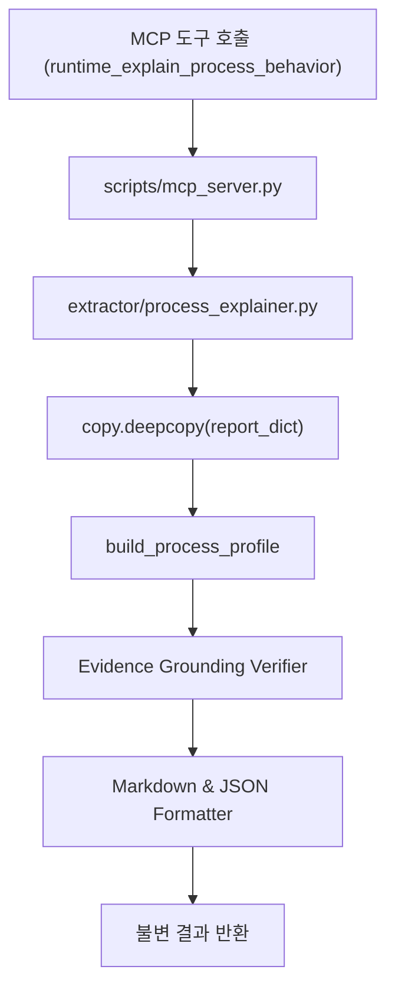

# Logical Components: Explanation Layer Immutability & Provenance (Unit 3)

> **Unit ID**: `unit-3-explanation-provenance`  

---

## 1. 컴포넌트 아키텍처

```mermaid
graph TD
    UserQuery["MCP 도구 호출 (runtime_explain_process_behavior)"] --> MCPBridge["scripts/mcp_server.py"]
    MCPBridge --> ExplainerCore["extractor/process_explainer.py"]
    ExplainerCore --> DefCopy["copy.deepcopy(report_dict)"]
    DefCopy --> ProfileBuilder["build_process_profile"]
    ProfileBuilder --> GroundingChecker["Evidence Grounding Verifier"]
    GroundingChecker --> TemplateFormatter["Markdown & JSON Formatter"]
    TemplateFormatter --> SafeResponse["불변 결과 반환"]
```
