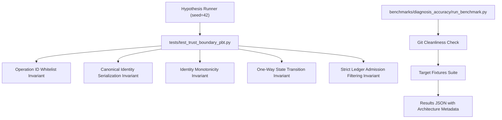

# Logical Components: PBT Invariants & Clean Benchmark Verification (Unit 4)

> **Unit ID**: `unit-4-pbt-dual-benchmark`  

---

## 1. 컴포넌트 아키텍처

```mermaid
graph TD
    HypothesisEngine["Hypothesis Runner (seed=42)"] --> PBTSuite["tests/test_trust_boundary_pbt.py"]
    PBTSuite --> OpIdCheck["Operation ID Whitelist Invariant"]
    PBTSuite --> CanonIdCheck["Canonical Identity Serialization Invariant"]
    PBTSuite --> ConflictCheck["Identity Monotonicity Invariant"]
    PBTSuite --> LifecycleCheck["One-Way State Transition Invariant"]
    PBTSuite --> AdmissionCheck["Strict Ledger Admission Filtering Invariant"]

    BenchRunner["benchmarks/diagnosis_accuracy/run_benchmark.py"] --> GitCheck["Git Cleanliness Check"]
    GitCheck --> RealTargets["Target Fixtures Suite"]
    RealTargets --> BenchResult["Results JSON with Architecture Metadata"]
```
