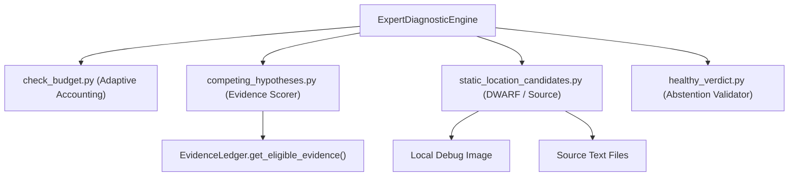

# Logical Components: Diagnosis Accuracy & Hypothesis Budgeting (Unit 5)

> **Unit ID**: `unit-5-diagnosis-accuracy-budget`  

---

## 1. 컴포넌트 아키텍처 다이어그램

```mermaid
graph TD
    DiagCore["ExpertDiagnosticEngine"] --> Budget["check_budget.py (Adaptive Accounting)"]
    DiagCore --> HypoMgr["competing_hypotheses.py (Evidence Scorer)"]
    DiagCore --> StaticCand["static_location_candidates.py (DWARF / Source)"]
    DiagCore --> VerdictMod["healthy_verdict.py (Abstention Validator)"]

    HypoMgr --> LedgerCheck["EvidenceLedger.get_eligible_evidence()"]
    StaticCand --> LocalDWARF["Local Debug Image"]
    StaticCand --> LocalSrc["Source Text Files"]
```
