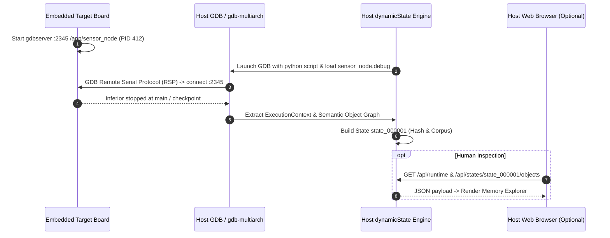

# dynamicState — Embedded Deployment Architecture & Toolchain Guide

## 1. Executive Summary & Design Principles

dynamicState is designed to observe and explore runtime memory states of C/C++ applications across diverse execution environments, ranging from high-performance x86_64 servers to resource-constrained ARM / AArch64 / RISC-V embedded target boards.

To ensure viability in real-world embedded systems, dynamicState enforces strict **Separation of Concerns**:

```
+-----------------------------------------------------------------------------------+
|                           DEVELOPER HOST WORKSTATION                              |
|                                                                                   |
|   +---------------------------------------------------------------------------+   |
|   | Human-Centric Web UI (Optional)                                            |   |
|   | http://localhost:8080 (Browser: Chrome, Firefox)                          |   |
|   +---------------------------------------------------------------------------+   |
|                                     | HTTP REST API                               |
|   +---------------------------------------------------------------------------+   |
|   | dynamicState Core Engine (Python 3.9+)                                    |   |
|   | - AgentRuntime / MCP Protocol                                             |   |
|   | - Semantic Object Graph Extractor & State Corpus                          |   |
|   | - Offline DWARF / ELF Parser & Build ID Verifier                          |   |
|   | - GDB Compatibility Layer (GDB 9.2 - 15.x)                                |   |
|   +---------------------------------------------------------------------------+   |
|                                     |                                             |
|        Unstripped ELF with DWARF    | Debugger Protocol (RSP) or Memory Dump      |
|        (/path/to/app.debug)         |                                             |
+-------------------------------------|---------------------------------------------+
                                      |
                     Network / Serial / File Transfer
                                      |
+-----------------------------------------------------------------------------------+
|                        EMBEDDED TARGET BOARD (Linux)                              |
|                                                                                   |
|  * ZERO Python installation required                                              |
|  * ZERO Web server running on target                                              |
|  * Runs stripped production binaries (-fPIE / ASLR enabled)                       |
|                                                                                   |
|  Pattern 1: Remote GDB (gdbserver :2345 /app/prod_bin)                            |
|  Pattern 2: Zero-Python Memory Capture (scripts/target_capture.sh <PID>)          |
+-----------------------------------------------------------------------------------+
```

### Key Architectural Rules
1. **Target Board is Python-Free**:
   - The embedded device does **not** need Python installed.
   - The embedded device does **not** need dynamicState code deployed on it.
2. **Web Server is 100% Optional and Host-Only**:
   - The Web UI server (`DynamicStateWebServer`) runs exclusively on the developer's host workstation.
   - The dynamicState core engine functions completely standalone without the Web server (via CLI, Python SDK, or MCP server).
3. **Debug Artifacts Remain on Host**:
   - Unstripped binaries, external `.debug` images, and symbol tables remain securely on the host workstation.
   - Target boards run stripped production binaries.
4. **Hostile Uncertainty Over Guesses**:
   - When architecture, endianness, or debug link information cannot be verified, it is reported as `UNKNOWN` or `UNAVAILABLE` rather than guessing.

---

## 2. Embedded Deployment Patterns

### Pattern 1: Remote GDB (`gdbserver` Attached or Launch)

This pattern provides full **CONSISTENT** observation, breakpoint stops, typed mutations, and branch-safe checkpoint-restore exploration.



#### Step-by-Step Instructions

1. **On Target Board**:
   Launch the target process under `gdbserver` or attach to an existing PID:
   ```bash
   # Launch new process:
   gdbserver :2345 /usr/bin/sensor_node

   # Or attach to running PID:
   gdbserver --attach :2345 412
   ```

2. **On Host Workstation**:
   Start dynamicState using the cross-debugger or multiarch GDB:
   ```bash
   # Option A: Start optional Web UI on developer machine
   python3 -m extractor server \
     --host 127.0.0.1 \
     --port 8080 \
     --debug-image /build/sensor_node.debug \
     --binary /build/sensor_node

   # Connect GDB to target board
   # (Inside GDB session or scripted via RuntimeController):
   target remote 192.168.1.100:2345
   ```

---

### Pattern 2: Zero-Python Direct Process Memory Capture

This pattern provides **LOW_IMPACT** observation without stopping the process, without installing GDB on the target, and with **zero Python dependencies** on the target board.

```mermaid
sequenceDiagram
    autonumber
    participant TargetApp as Running Target Process (PID 890)
    participant CaptureScript as target_capture.sh (POSIX sh + dd)
    participant Host as Host Workstation (dynamicState)

    Note over TargetApp: Running multi-threaded mission-critical application
    CaptureScript->>TargetApp: Read /proc/890/maps (zero pause)
    CaptureScript->>TargetApp: Read readable memory via /proc/890/mem with dd
    CaptureScript->>CaptureScript: Package raw_snapshot/ bundle
    Note over TargetApp: Process never stopped; zero downtime
    CaptureScript->>Host: Transfer bundle (scp / rsync / SD card / NFS)
    Host->>Host: Offline DWARF semantic reconstruction with sensor_node.debug
    Host->>Host: Produce Semantic Snapshot S_M_001
```

#### Step-by-Step Instructions

1. **On Target Board**:
   Run the lightweight POSIX capture script [`scripts/target_capture.sh`](file:///home/ubuntu/workspace/ut/scripts/target_capture.sh):
   ```bash
   chmod +x scripts/target_capture.sh
   ./scripts/target_capture.sh 890 /tmp/snapshot_890
   ```
   Output bundle generated:
   ```
   /tmp/snapshot_890/
   ├── metadata.json       # PID, capture timestamp, page size, kernel info
   ├── maps.txt            # Snapshot of /proc/$PID/maps
   └── chunks/             # Memory segments (heap, bss, data, stack)
       ├── chunk_0000.bin
       ├── chunk_0001.bin
       └── ...
   ```

2. **Transfer to Host Workstation**:
   ```bash
   scp -r root@192.168.1.100:/tmp/snapshot_890 /home/developer/snapshots/
   ```

3. **On Host Workstation**:
   Reconstruct the full semantic object graph offline using the unstripped debug image:
   ```bash
   python3 -m extractor.low_impact \
     --raw-snapshot /home/developer/snapshots/snapshot_890 \
     --debug-image /build/sensor_node.debug \
     --output /home/developer/corpus/state_890.json
   ```
   Or launch the Web UI to visually explore the offline memory snapshot:
   ```bash
   python3 -m extractor server \
     --host 127.0.0.1 \
     --port 8080 \
     --snapshot /home/developer/corpus/state_890.json \
     --debug-image /build/sensor_node.debug
   ```

---

## 3. GDB Version Compatibility & Defense Layer

Embedded cross-toolchains frequently bundle older LTS GDB releases (such as **GDB 9.2** in Ubuntu 20.04 LTS or Yocto Dunfell) or modern versions (GDB 14/15).

dynamicState provides a dedicated GDB compatibility module in [`extractor/gdb_compat.py`](file:///home/ubuntu/workspace/ut/extractor/gdb_compat.py) to guarantee deterministic operation without crashes.

### Compatibility Matrix

| Feature | GDB 9.2 | GDB 10.x | GDB 11.x+ | dynamicState Compat Handling (`extractor/gdb_compat.py`) |
| :--- | :--- | :--- | :--- | :--- |
| `gdb.Frame.level()` | ❌ Not available | ❌ Not available | ✅ Available | Track stack depth manually during frame traversal; fallback to depth counter |
| `gdb.Frame.function()` | ⚠️ May return `None` | ⚠️ May return `None` | ✅ Available | Safe wrapper returning function name string or `None` |
| `gdb.Frame.pc()` | ✅ Available | ✅ Available | ✅ Available | Safe wrapper returning integer PC |
| `gdb.Progspace.filename` | ⚠️ May raise `AttributeError` | ✅ Available | ✅ Available | Try-catch attribute access, fallback to `None` |
| `gdb.Thread.is_stopped()` | ⚠️ Attribute differences | ✅ Available | ✅ Available | Check `is_stopped()` -> `is_valid()` -> fallback `True` |
| Python API Version | Python 3.8+ | Python 3.8+ | Python 3.10+ | Pure Python standard library constructs only |

### Implementation Detail: `get_frame_level` Fallback

In GDB 9.2 and 10.x, calling `frame.level()` raises `AttributeError: 'gdb.Frame' object has no attribute 'level'`.

In `extractor/gdb_compat.py`:
```python
def get_frame_level(frame: Any, fallback_level: int = 0) -> int:
    """Safely get frame level across all GDB versions (GDB 9.2+)."""
    if hasattr(frame, "level"):
        try:
            return frame.level()
        except Exception:
            pass
    return fallback_level
```

In `extractor/execution.py`:
```python
stack_depth = 0
while frame is not None and len(frames) < max_depth:
    level = get_frame_level(frame, fallback_level=stack_depth)
    # ... record frame info ...
    frame = frame.older()
    stack_depth += 1
```

---

## 4. Web Server Process Model & Clean Ctrl+C Shutdown

### The SocketServer Deadlock Issue
In standard Python `socketserver.TCPServer`, calling `server.shutdown()` from the **same thread** that is currently blocked in `serve_forever()` results in an immediate permanent deadlock (as documented in Python stdlib).

### Non-Deadlocking Server Loop Design
dynamicState implements `run_server_loop(server)` in [`extractor/web/server.py`](file:///home/ubuntu/workspace/ut/extractor/web/server.py):

```python
def run_server_loop(server: DynamicStateWebServer):
    """Run server loop with non-deadlocking signal handling."""
    stop_event = threading.Event()

    def _sig_handler(sig, frame):
        stop_event.set()

    signal.signal(signal.SIGINT, _sig_handler)
    signal.signal(signal.SIGTERM, _sig_handler)

    server_thread = threading.Thread(
        target=lambda: server.serve_forever(poll_interval=0.2),
        daemon=True
    )
    server_thread.start()

    try:
        while not stop_event.is_set():
            stop_event.wait(timeout=0.2)
    finally:
        server.shutdown()
        server.server_close()
        server_thread.join(timeout=1.0)
```

**Benefits**:
- Hitting `Ctrl+C` immediately wakes up the main thread.
- `server.shutdown()` is called from the main thread while `serve_forever` is in a background thread.
- Port is immediately freed (`SO_REUSEADDR`).
- Exits cleanly with status code `0`.

---

## 5. Command-Line Reference

```bash
# 1. Launch Web UI server with active GDB controller:
python3 -m extractor server --host 127.0.0.1 --port 8080 --binary /app/target --debug-image /app/target.debug

# 2. Launch Web UI server in offline viewing mode for an existing state corpus:
python3 -m extractor server --host 127.0.0.1 --port 8080 --corpus /path/to/corpus_dir

# 3. Capture zero-Python memory dump on embedded target:
./scripts/target_capture.sh <PID> [output_directory]

# 4. Run full test suite including GDB compatibility:
python3 -m unittest discover tests
```
