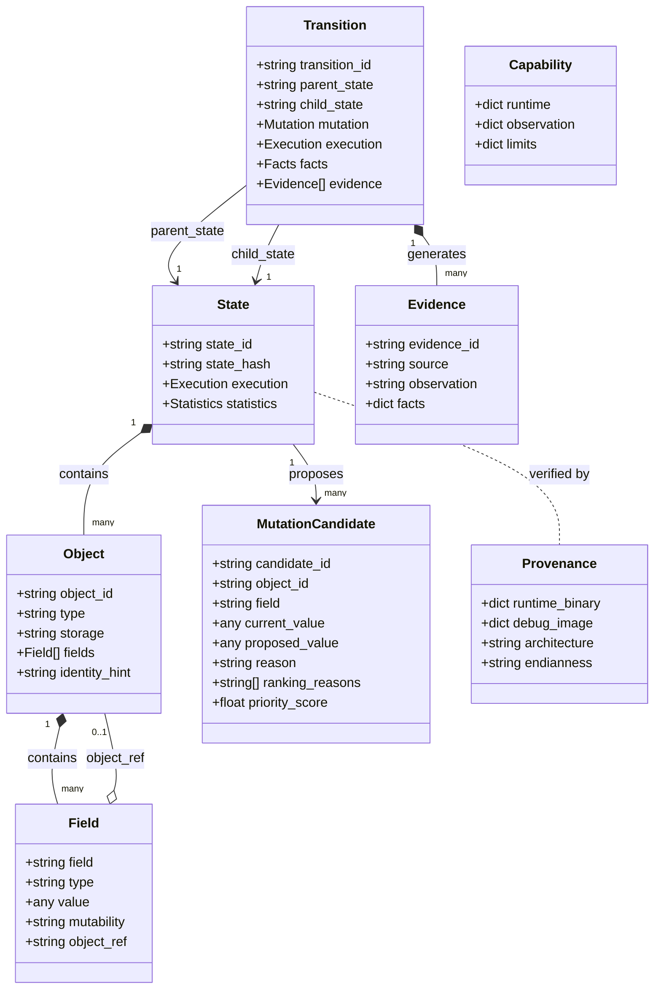

# dynamicState — Phase 6.0 Agent-Facing Semantic API & MCP Design Specification

**Document Version:** 1.0.0  
**Phase:** 6.0 (Agent-Facing Semantic API Audit & MCP Design)  
**Status:** COMPLETE / APPROVED  
**Target Repository:** `zeeny2park/dynamicState`

---

## 1. Design Goals

The primary goal of Phase 6.0 is to transform `dynamicState` from a low-level runtime inspection framework into an **Agent-Native Semantic Runtime Engine**. 

```text
    Coding Agent (Autonomous Reasoning Layer)
          │
          │ Agent Runtime Protocol (JSON-Serializable Semantic Contract)
          │ (Future MCP Tool Layer / RPC / Python SDK)
          ▼
    AgentRuntime (Semantic Abstraction Boundary)
          │
          ├── Progressive Disclosure (Levels 1–7)
          ├── Zero Information Leakage (No PIDs, Hex Addresses, Registers, GDB)
          ├── Pre-Validated Mutation Candidates with Explainable Reasons
          ├── Branch-Safe Process Checkpoint & Isolation
          └── Address-Independent Deterministic State Hashing
          │
          ▼
    RuntimeController / MemoryCapture
          │
          ├── GDB (CONSISTENT: stop-the-world, atomic, mutable)
          └── process_vm_readv (LOW_IMPACT: zero-stop, non-atomic, read-only)
          │
          ▼
    Production Binary (C/C++ Workload)
```

### Core Tenets
1. **Semantic Abstraction First**: The Agent never sees GDB commands, process PIDs, inferior numbers, raw memory addresses, CPU registers, or DWARF internal structures.
2. **Branch-Safe Hypothesis Exploration**: State exploration is strictly branch-safe. Parent states are preserved via copy-on-write checkpoints so crashes, timeouts, and experimental mutations never corrupt sibling branches.
3. **Progressive Disclosure**: Avoid context window explosion. Provide summary metrics by default and allow the Agent to inspect objects, fields, and transitions on demand.
4. **Deterministic Semantic State Identity**: State equivalence is established by canonical object graphs and call frames, independent of ASLR, memory allocations, or storage class.
5. **Strict Safety Boundary**: Arbitrary memory writes, arbitrary pointer fabrication, shell execution, and ptrace bypasses are impossible. Mutations are strictly bounded by pre-validated `MutationCandidate` proposals.

---

## 2. Non-Goals

1. **No MCP Server Implementation Yet**: Phase 6.0 establishes the contract, protocol schemas, and API boundary. The actual MCP JSON-RPC transport and network server belong to Phase 6.1.
2. **No Autonomous LLM Loop inside dynamicState**: dynamicState is the runtime engine, not the reasoning agent. It provides tools for external agents.
3. **No Native DWARF Parser Re-implementation**: dynamicState leverages existing robust toolchains (GDB python backend for CONSISTENT mode, ELF/DWARF extractors for offline analysis).
4. **No Database Dependencies**: The State Corpus and runtime cache remain lightweight, filesystem-backed JSON artifacts.

---

## 3. Agent Semantic Model

The Agent interacts with runtime state through 10 first-class semantic concepts:



### 1. State
A deterministic, address-independent point in program execution.
```json
{
  "state_id": "state_000001",
  "state_hash": "4c61e1ee15c6c5f6",
  "summary": {
    "object_count": 9,
    "root_count": 1,
    "edge_count": 12
  }
}
```

### 2. Object
A semantic runtime instance identified by a stable topological ID (`obj_0001`), type, and storage classification.
```json
{
  "object_id": "obj_0001",
  "type": "Session",
  "storage": "heap",
  "identity_hint": "Session:obj_0001"
}
```

### 3. Field
A named, typed member of an object. Pointer fields resolve to target `object_ref` IDs or symbolic representations (`<null>`, `<pointer>`), never raw memory addresses.
```json
{
  "object_id": "obj_0001",
  "field": "retry",
  "type": "uint32_t",
  "value": 2,
  "mutability": "mutable",
  "object_ref": null
}
```

### 4. Relationship
A typed reference between objects. Cyclic references are naturally handled by object references (e.g. `parent: obj_0001`).
```text
Session (obj_0001)
  ├── buffer -> Buffer (obj_0002)
  ├── peer   -> Session (obj_0003)
  └── parent -> Session (obj_0001) [Self-Reference]
```

### 5. Mutation Candidate
A type-checked, bound-checked hypothesis proposed by the engine with explainable heuristics.
```json
{
  "candidate_id": "M0004",
  "object_id": "obj_0001",
  "field": "retry",
  "type": "uint32_t",
  "current_value": 2,
  "proposed_value": 3,
  "reason": "BOUNDARY_PLUS_ONE",
  "priority_score": 6.5,
  "ranking_reasons": ["BRANCH_SENSITIVE", "EXECUTION_REACHABLE", "NUMERIC_BOUNDARY"]
}
```

### 6. Transition
An observed execution step connecting a parent state to a child state as the result of a mutation and resume.
```json
{
  "transition_id": "T001",
  "parent_state": "state_000001",
  "child_state": "state_000002",
  "mutation": {
    "object_id": "obj_0001",
    "field": "retry",
    "before": 2,
    "after": 3
  },
  "execution": {
    "status": "STOPPED",
    "reason": "breakpoint"
  }
}
```

### 7. Evidence
A verified factual finding extracted from a transition without subjective speculation.
```json
{
  "evidence_id": "EV_0003",
  "source": "diff",
  "observation": "Session.state changed from CONNECTED to ERROR",
  "facts": {
    "path": "Session.state",
    "before": "CONNECTED",
    "after": "ERROR"
  }
}
```

### 8. Failure
An explicit categorization of execution issues: `MUTATION_REJECTED`, `APPLICATION_CRASH`, `EXECUTION_TIMEOUT`, `DEBUG_IMAGE_MISMATCH`, or `CAPABILITY_UNSUPPORTED`.

### 9. Capability
An explicit declaration of what operations are supported by the active observation mode.
```json
{
  "observation_mode": "CONSISTENT",
  "mutation_supported": true,
  "checkpoint_supported": true,
  "atomic_observation": true
}
```

### 10. Provenance
Verification status of the target binary and DWARF debug image, including Build ID matching and target architecture.
```json
{
  "runtime_binary": { "stripped": true, "build_id": "6dd8f503..." },
  "debug_image": { "verified": true, "compatible": true }
}
```

---

## 4. Agent Workflow

The standard agent interaction follows a disciplined scientific cycle:

```text
    1. OBSERVE (Summary & Coordinates)
           │
           ▼
    2. DISCOVER OBJECTS (Select target subsystem)
           │
           ▼
    3. INSPECT OBJECT (Review fields and references)
           │
           ▼
    4. QUERY MUTATION CANDIDATES (Retrieve explainable hypotheses)
           │
           ▼
    5. CAPTURE CHECKPOINT (Preserve current state)
           │
           ▼
    6. EXECUTE TRANSITION (Apply hypothesis & resume inferior)
           │
           ▼
    7. VERIFY EVIDENCE (Inspect facts, diff, state hash)
           │
           ├── Succeeded? ──► Continue deeper exploration
           │
           └── Need alternative hypothesis / Crash?
                     │
                     ▼
           8. RESTORE CHECKPOINT (Rollback cleanly to parent)
                     │
                     ▼
           9. EXECUTE SIBLING BRANCH
```

---

## 5. Progressive Disclosure

To prevent LLM context saturation, data is delivered across 7 progressive detail tiers:

| Tier | API / Tool | Content Returned | Typical Payload Size |
|---|---|---|---|
| **Level 1 — Summary** | `observe()` | Execution function, file/line, object count, top 10 object types, state hash | ~0.5 KB |
| **Level 2 — Objects List** | `list_objects()` | All reachable objects (`object_id`, `type`, `storage`) | ~1.5 KB |
| **Level 3 — Object Detail** | `inspect_object(id)` | Complete fields of single object, pointers resolved to `object_ref` | ~1.0 KB |
| **Level 4 — Field Detail** | `inspect_field(id, field)` | DWARF type, current value, mutability (`mutable`/`read_only`) | ~0.3 KB |
| **Level 5 — Candidates** | `list_mutation_candidates()` | Ranked hypotheses with `reason` and explainable ranking signals | ~2.0 KB |
| **Level 6 — Transition** | `execute_transition(cand)` | Outcome (`STOPPED`/`CRASHED`), changed fields, child state ID | ~1.2 KB |
| **Level 7 — Evidence** | `inspect_transition(tid)` | Granular before/after diffs, invariant status, factual observations | ~2.5 KB |

---

## 6. State Hash Semantics

State equivalence in `dynamicState` is defined strictly at the **semantic level**, not the memory-address level.

### Properties of `state_hash`
- **ASLR Independent**: Running the same binary under different ASLR slide offsets produces identical hashes.
- **Address Independent**: Memory pointers (`0x7fff...`, `0xaaaa...`) are canonicalized to topological BFS visit indices (`C_0`, `C_1`, ...).
- **Storage Class Independent**: Identical semantic objects yield the same hash whether allocated on heap or stack.
- **Thread ID Independent**: Process-local thread IDs and PIDs are stripped from the hash input.
- **Cycle Safe**: Graph traversal detects cyclic pointers and represents them as relative references (`ref:C_0`, `self`).

---

## 7. State Graph Semantics

The State Graph represents the discovered state-space as a Directed Acyclic Graph (DAG) of semantic states and transitions:

```text
       [State 1: CONNECTED] (Hash: 4c61e1ee15c6c5f6)
          ├─── retry = 2 -> 3 (T001) ───► [State 2: ERROR] (Hash: 56d6d71bd1593342)
          │                                  └── flagged: true, error_code: 101
          │
          ├─── retry = 2 -> 0 (T002) ───► [State 3: DISCONNECTED] (Hash: 9944af0d94c034dc)
          │                                  └── state: DISCONNECTED
          │
          └─── priority = 7 -> 139 (T003) ─► [State: CRASHED] (SIGSEGV)
                                              └── Isolation Preserved: Parent Restorable
```

The State Graph provided to Agents is purely semantic: nodes are state IDs with hashes and status summaries; edges represent transitions tagged with mutated field, before/after values, and execution outcome. No UI layout or SVG data is transmitted to the Agent.

---

## 8. Mutation Candidate Semantics

`dynamicState` rejects random fuzzing in favor of explainable, typed mutation candidates generated from DWARF type bounds and runtime values:

| Heuristic | Reason Code | Description | Example |
|---|---|---|---|
| **Boundary Plus One** | `BOUNDARY_PLUS_ONE` | Adjacent upper boundary value | `retry: 2 -> 3` |
| **Boundary Minus One** | `BOUNDARY_MINUS_ONE` | Adjacent lower boundary value | `retry: 2 -> 1` |
| **Zero Boundary** | `ZERO_BOUNDARY` | Minimum natural boundary | `retry: 2 -> 0` |
| **Max Boundary** | `MAX_BOUNDARY` | Maximum range boundary of type | `retry: 2 -> 4294967295` |
| **Enum Member** | `ENUM_MEMBER` | Alternate symbolic member of enum | `state: CONNECTED -> ERROR` |
| **Boolean Toggle** | `BOOLEAN_TOGGLE` | Invert boolean flag | `flagged: false -> true` |
| **Pointer Null** | `POINTER_NULL` | Disconnect pointer edge | `buffer: obj_0002 -> <null>` |

Every candidate includes `ranking_reasons` (`BRANCH_SENSITIVE`, `NUMERIC_BOUNDARY`, `RECENTLY_CHANGED`) so an Agent can choose candidates based on reasoned technical goals.

---

## 9. Failure Semantics

Failures are disambiguated into mutually exclusive categories:

```text
┌────────────────────────────────────────────────────────────────────────┐
│                        Failure Taxonomy                                │
├──────────────────────────┬─────────────────────────┬───────────────────┤
│ Failure Class            │ Error / Status Code     │ System State      │
├──────────────────────────┼─────────────────────────┼───────────────────┤
│ Mutation Rejected        │ MUTATION_REJECTED       │ Stopped at Parent │
│                          │ TYPE_CONVERSION_ERROR   │ (Inferior not run)│
│                          │ RANGE_ERROR             │                   │
├──────────────────────────┼─────────────────────────┼───────────────────┤
│ Application Fault        │ Status: CRASHED         │ Process terminated│
│                          │ Signal: SIGSEGV/SIGABRT │ (Restorable via   │
│                          │                         │  parent CP)       │
├──────────────────────────┼─────────────────────────┼───────────────────┤
│ Execution Timeout        │ Status: TIMEOUT         │ Interrupted       │
│                          │                         │ (Restorable)      │
├──────────────────────────┼─────────────────────────┼───────────────────┤
│ Capability Violation     │ CAPABILITY_UNSUPPORTED  │ Rejected          │
├──────────────────────────┼─────────────────────────┼───────────────────┤
│ Debug Image Mismatch     │ DEBUG_IMAGE_MISMATCH    │ Unverified        │
│                          │ BUILD_ID_MISMATCH       │ Observation halted│
├──────────────────────────┼─────────────────────────┼───────────────────┤
│ Semantic Entity Missing  │ INVALID_OBJECT          │ Request rejected  │
│                          │ INVALID_FIELD           │                   │
│                          │ CHECKPOINT_NOT_FOUND    │                   │
└──────────────────────────┴─────────────────────────┴───────────────────┘
```

An Agent never receives a raw Python traceback or unhandled GDB SIGSEGV.

---

## 10. Capability Model

`dynamicState` strictly distinguishes two observation operational modes:

| Capability | CONSISTENT Mode | LOW_IMPACT Mode |
|---|---|---|
| **Mechanism** | GDB Stop-the-world | Linux `process_vm_readv` |
| **Process Stop** | Yes (Inferior stopped at checkpoint/bp) | No (Process runs concurrently) |
| **Memory Consistency** | Atomic (Process frozen) | Non-atomic (Torn reads handled gracefully) |
| **Object Graph Extraction** | Live runtime evaluation | Offline DWARF reconstruction from dump |
| **Execution Context** | Available (thread stack, line, function) | `UNAVAILABLE` (reason: `LOW_IMPACT_MEMORY_SNAPSHOT`) |
| **Mutation Supported** | Supported | `CAPABILITY_UNSUPPORTED` |
| **Checkpoint / Restore** | Supported (GDB copy-on-write fork) | `CAPABILITY_UNSUPPORTED` |
| **Transition Execution** | Supported | `CAPABILITY_UNSUPPORTED` |

---

## 11. Provenance Model

Provenance verifies that semantic runtime observations correspond strictly to genuine compilation artifacts:
- **Build ID Matching**: The runtime binary's `.note.gnu.build-id` must match the DWARF image.
- **GNU Debuglink**: If stripped, `.gnu_debuglink` with CRC32 verification resolves the detached debug file.
- **Target Architecture**: Architecture (`aarch64`, `x86_64`) and endianness (`little`, `big`) are explicitly declared and verified without silent fallbacks.
- **Redaction of Low-Level Offsets**: ELF load biases, page tables, and `/proc` mapping offsets are omitted from Agent views.

---

## 12. Safety Boundary

The Agent API enforces an ironclad security sandbox:
- **No Arbitrary Memory Writes**: Memory modification is only possible via a validated `MutationCandidate`.
- **No Arbitrary Pointer Fabrication**: Agents cannot point pointers to arbitrary memory addresses.
- **No Shell Execution**: No commands are executed in shell environments.
- **No Direct GDB CLI Access**: GDB commands cannot be injected by the Agent.
- **Process Isolation**: Faulty branches cannot damage the parent inferior process.

---

## 13. Agent Context Strategy

To maximize efficiency and fit tight context budgets:
1. `observe()` returns a compact context (~500 bytes) containing execution function, file, line, and top 10 objects.
2. Large buffers (e.g. 10MB byte arrays) are truncated or summarized to lengths/capacities unless specifically inspected.
3. Pointer fields report symbolic object references (`obj_0002`), reducing deep recursive expansion.
4. Diff evidence reports only changed fields rather than duplicating identical unchanged objects.

---

## 14. Agent-Driven vs Runtime-Driven Exploration

| Aspect | Runtime-Driven (`explore()`) | Agent-Driven (Interactive Loop) |
|---|---|---|
| **Control** | Systematic BFS/DFS engine loop | LLM reasoning step-by-step |
| **Hypothesis Generation** | Numeric heuristics and heuristics ranking | Domain-aware semantic hypotheses |
| **Token Cost** | Zero token cost during exploration | Context tokens consumed per step |
| **Search Breadth** | High throughput across many candidates | Targeted, narrow, deep reasoning |
| **Optimal Use Case** | Initial state discovery and fuzzing | Root cause analysis, reproducing subtle logic bugs |

**Recommendation for MCP**: Expose primitive tools (`observe`, `inspect`, `list_candidates`, `execute_transition`, `checkpoint`, `restore`) as the primary interface, allowing the Agent to conduct hypothesis-driven debugging. Provide `runtime_explore` as a convenience tool for rapid broad coverage.

---

## 15. Proposed MCP Tool Boundary

The proposed Model Context Protocol (MCP) tools for dynamicState:

| Tool Name | Purpose | Side Effects | Safety Level |
|---|---|---|---|
| `runtime_observe` | Get compact summary of current runtime state | None | Read-only |
| `runtime_list_objects` | List all reachable semantic objects in state | None | Read-only |
| `runtime_inspect_object` | Inspect all fields of a specific object | None | Read-only |
| `runtime_inspect_field` | Inspect single field type, value, and mutability | None | Read-only |
| `runtime_list_candidates` | Discover and rank type-safe mutation hypotheses | Caches candidates | Read-only |
| `runtime_checkpoint` | Create branch-safe savepoint | Forks COW checkpoint | State-preserving |
| `runtime_restore` | Rollback execution state to a savepoint | Restores inferior memory | Mutating / Rollback |
| `runtime_execute_transition` | Apply candidate mutation and resume execution | Advances execution | Mutating / Verified |
| `runtime_inspect_transition` | Inspect semantic diff, facts, and evidence | None | Read-only |
| `runtime_state_hash` | Get deterministic semantic state hash | None | Read-only |
| `runtime_capabilities` | Query backend capabilities and limits | None | Read-only |

### Detailed Tool Specifications

#### 1. `runtime_observe`
- **Input**: `{ "mode": "CONSISTENT" | "LOW_IMPACT" }`
- **Output**: `AgentStateContext` (Level 1 Summary)
- **Errors**: `RUNTIME_NOT_STOPPED`, `RUNTIME_ERROR`

#### 2. `runtime_inspect_object`
- **Input**: `{ "object_id": string, "snapshot_id"?: string }`
- **Output**: `AgentObject` (Level 3 Object Detail)
- **Errors**: `INVALID_OBJECT`, `SNAPSHOT_NOT_FOUND`

#### 3. `runtime_inspect_field`
- **Input**: `{ "object_id": string, "field": string, "snapshot_id"?: string }`
- **Output**: `AgentField` (Level 4 Field Detail)
- **Errors**: `INVALID_OBJECT`, `INVALID_FIELD`

#### 4. `runtime_list_candidates`
- **Input**: `{ "snapshot_id"?: string }`
- **Output**: `AgentMutationCandidate[]` (Level 5 Candidates)
- **Errors**: `CAPABILITY_UNSUPPORTED` (if in LOW_IMPACT)

#### 5. `runtime_checkpoint`
- **Input**: `{ "checkpoint_id"?: string }`
- **Output**: `{ "checkpoint_id": string }`
- **Errors**: `CAPABILITY_UNSUPPORTED`, `SAFETY_LIMIT_REACHED`

#### 6. `runtime_restore`
- **Input**: `{ "checkpoint_id": string }`
- **Output**: `{ "restored": true, "checkpoint_id": string }`
- **Errors**: `CHECKPOINT_NOT_FOUND`, `CAPABILITY_UNSUPPORTED`

#### 7. `runtime_execute_transition`
- **Input**: `{ "candidate_id"?: string, "candidate"?: object, "timeout_ms"?: number }`
- **Output**: `AgentTransition` (Level 6 Transition Summary & Facts)
- **Errors**: `INVALID_CANDIDATE`, `MUTATION_REJECTED`, `CAPABILITY_UNSUPPORTED`

---

## 16. Example Agent Session

The following transcript demonstrates an autonomous coding agent reasoning and debugging an issue using ONLY the semantic API:

```text
Agent:
  call runtime_observe()

Tool Output:
  {
    "snapshot_id": "S001",
    "state_id": "state_000001",
    "state_hash": "4c61e1ee15c6c5f6",
    "execution": {
      "function": "runtime_state_checkpoint",
      "location": "sample_prod.cpp:62",
      "pc": null
    },
    "objects": [
      {
        "object_id": "obj_0001",
        "type": "Session",
        "storage": "heap",
        "fields": {
          "retry": 2,
          "state": "CONNECTED",
          "buffer": "obj_0002",
          "parent": "obj_0001"
        }
      }
    ],
    "statistics": { "object_count": 9, "root_count": 1 }
  }

Agent Reasoning:
  "The inferior is stopped at sample_prod.cpp:62. The Session object (obj_0001) has retry=2 and state=CONNECTED.
  Let's inspect the Session object to check all fields."

Agent:
  call runtime_inspect_object(object_id="obj_0001")

Tool Output:
  {
    "object_id": "obj_0001",
    "type": "Session",
    "storage": "heap",
    "fields": [
      { "name": "retry", "type": "uint32_t", "value": 2 },
      { "name": "state", "type": "SessionState", "value": "CONNECTED" },
      { "name": "buffer", "type": "Buffer*", "value": "obj_0002", "object_ref": "obj_0002" },
      { "name": "parent", "type": "Session*", "value": "obj_0001", "object_ref": "obj_0001" }
    ]
  }

Agent Reasoning:
  "I want to explore what happens when retry limit is exceeded. Let's see proposed candidates for retry."

Agent:
  call runtime_list_candidates()

Tool Output:
  [
    {
      "candidate_id": "M0004",
      "object_id": "obj_0001",
      "field": "retry",
      "current_value": 2,
      "proposed_value": 3,
      "reason": "BOUNDARY_PLUS_ONE",
      "ranking_reasons": ["BRANCH_SENSITIVE", "NUMERIC_BOUNDARY"]
    },
    {
      "candidate_id": "M0005",
      "object_id": "obj_0001",
      "field": "retry",
      "current_value": 2,
      "proposed_value": 0,
      "reason": "ZERO_BOUNDARY",
      "ranking_reasons": ["BRANCH_SENSITIVE", "NUMERIC_BOUNDARY"]
    }
  ]

Agent Reasoning:
  "Before trying retry=3, let's create a checkpoint C_SEED so I can test retry=0 as an alternative hypothesis afterwards."

Agent:
  call runtime_checkpoint(checkpoint_id="C_SEED")

Tool Output:
  { "checkpoint_id": "C_SEED" }

Agent:
  call runtime_execute_transition(candidate_id="M0004")

Tool Output:
  {
    "transition_id": "T001",
    "parent_state": "state_000001",
    "child_state": "state_000002",
    "mutation": { "field": "retry", "before": 2, "after": 3 },
    "execution": { "status": "STOPPED", "reason": "breakpoint" },
    "facts": {
      "branch_changed": true,
      "field_changed": ["Session.flagged", "Session.packet_count", "Session.retry", "Session.state"],
      "crash": false
    },
    "evidence": [
      {
        "observation": "Session.state changed from CONNECTED to ERROR",
        "facts": { "path": "Session.state", "before": "CONNECTED", "after": "ERROR" }
      }
    ]
  }

Agent Reasoning:
  "State transitioned to ERROR as hypothesized when retry reached 3.
  Now let's restore C_SEED and test alternative hypothesis retry=0."

Agent:
  call runtime_restore(checkpoint_id="C_SEED")

Tool Output:
  { "restored": true, "checkpoint_id": "C_SEED" }

Agent:
  call runtime_execute_transition(candidate_id="M0005")

Tool Output:
  {
    "transition_id": "T002",
    "parent_state": "state_000001",
    "child_state": "state_000003",
    "mutation": { "field": "retry", "before": 2, "after": 0 },
    "execution": { "status": "STOPPED", "reason": "breakpoint" },
    "facts": {
      "branch_changed": true,
      "field_changed": ["Session.packet_count", "Session.retry", "Session.state"],
      "crash": false
    },
    "evidence": [
      {
        "observation": "Session.state changed from CONNECTED to DISCONNECTED",
        "facts": { "path": "Session.state", "before": "CONNECTED", "after": "DISCONNECTED" }
      }
    ]
  }

Agent Conclusion:
  "Verified through state transitions:
   1. retry=3 causes transition to ERROR state (Hash: 56d6d71bd1593342).
   2. retry=0 causes transition to DISCONNECTED state (Hash: 9944af0d94c034dc).
   Both branches were explored in clean isolation without inferior restart or memory leaks."
```

Notice that during the entire session:
- Zero raw memory addresses were exposed.
- Zero GDB commands were typed.
- Zero PIDs or inferior IDs were needed.
- Complete branch safety and state verification were maintained.
